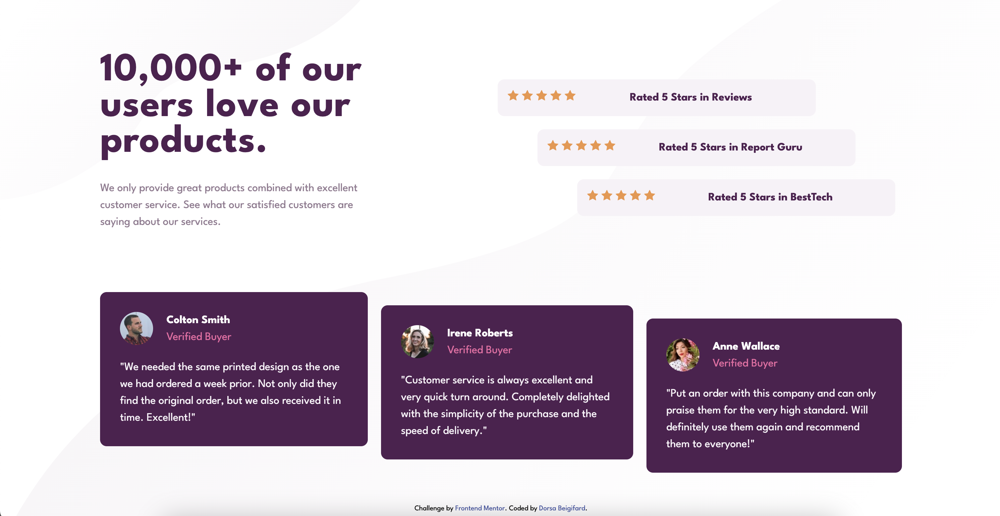
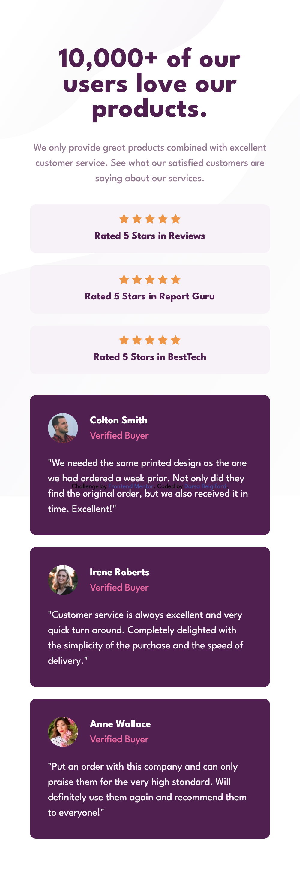

# Frontend Mentor - Social proof section solution

This is a solution to the [Social proof section challenge on Frontend Mentor](https://www.frontendmentor.io/challenges/social-proof-section-6e0qTv_bA). Frontend Mentor challenges help you improve your coding skills by building realistic projects. 

## Table of contents

- [Overview](#overview)
  - [The challenge](#the-challenge)
  - [Screenshot](#screenshot)
  - [Links](#links)
- [My process](#my-process)
  - [Built with](#built-with)
  - [What I learned](#what-i-learned)

## Overview

### The challenge

Users should be able to:

- View the optimal layout for the section depending on their device's screen size

### Screenshot

### Links

- Solution URL: [Solution URL here](https://github.com/DorsaBeigifard/FEM-social-proof-section)
- Live Site URL: [Live site URL here](https://dorsabeigifard.github.io/FEM-social-proof-section/)

## My process

### Built with

- Semantic HTML5 markup
- CSS custom properties
- Flexbox
- CSS Grid
- Mobile-first workflow
- Responsive design

### What I learned
I recently took on this front-end coding challenge, using my shiny new HTML and CSS skills. It was like putting together a puzzle with all the pieces I'd learned. 

Exploring CSS Grid and Flexbox was surprisingly enjoyable – it was like playing with virtual Legos! But then, ensuring everything looked sleek on various devices posed a new challenge. Working with media queries and embracing a mobile-first approach was a bit daunting at first, but I'm thrilled I took that route.

Along the way, I stumbled upon clamp() and discovered how it could enhance responsiveness. Integrating it with the vw unit allowed me to witness the webpage adapt seamlessly to dynamic resizing.

At the end, seeing everything come together was totally worth it!
I can't wait to learn more and do more challenging projects.
